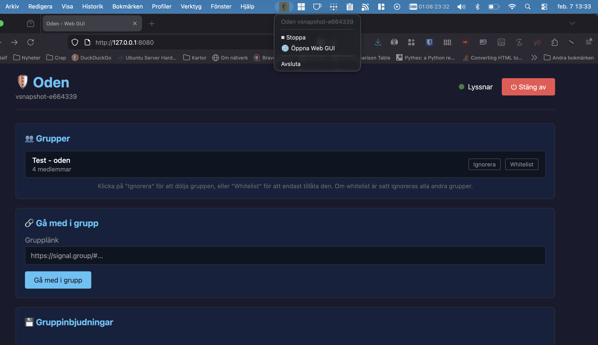
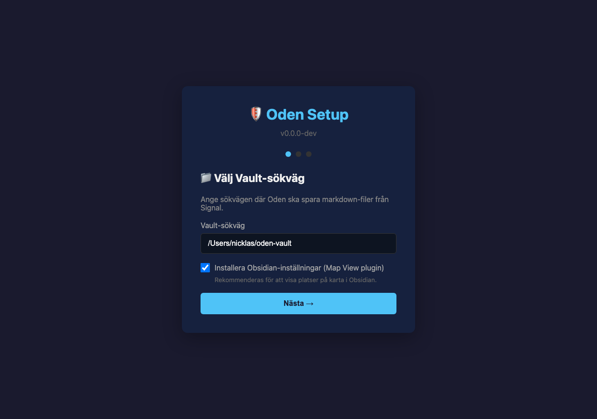
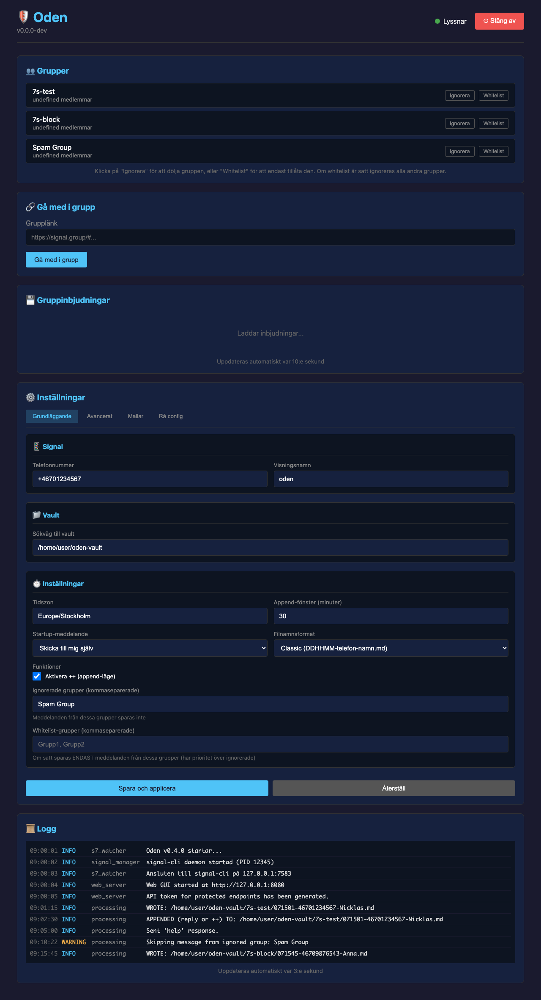

# Oden S7 Watcher


Oden tar emot Signal-meddelanden och sparar dem som Markdown-filer i ditt Obsidian-valv.

## Snabbstart

### macOS (DMG)

**Automatisk installation** — kör i Terminal:

```bash
curl -fsSL https://raw.githubusercontent.com/NicklasAndersson/oden/main/scripts/install_mac.sh | bash
```

Skriptet laddar ner senaste DMG, installerar Oden.app i Applications och tar bort karantänattributet (Gatekeeper).

**Manuell installation:**

1. Ladda ner `.dmg` från [senaste releasen](https://github.com/NicklasAndersson/oden/releases/latest)
2. Öppna den och dra **Oden.app** till **Applications**
3. Kör i Terminal:

```bash
xattr -cr /Applications/Oden.app
```

Sista steget behövs eftersom vi saknar Apple-certifikat. Alternativt kan du högerklicka på appen och välja **"Öppna"** — då får du möjlighet att öppna den trots varningen.

### Docker (Linux, Windows, Raspberry Pi)

```bash
docker run -d \
  --name oden \
  -p 8080:8080 \
  -v oden-data:/data \
  -v ./vault:/vault \
  ghcr.io/nicklasandersson/oden:latest
```

Eller med `docker compose`:

```bash
curl -O https://raw.githubusercontent.com/NicklasAndersson/oden/main/docker-compose.yml
docker compose up -d
```

Öppna sedan `http://localhost:8080/setup` i din webbläsare för att konfigurera.

Se [docs/FEATURES.md](./docs/FEATURES.md) för komplett funktionsdokumentation.

### Signal-konto

**Viktigt:** Använd inte ditt privata Signal-nummer! Skaffa ett dedikerat nummer för Oden (t.ex. ett billigt kontantkort eller VoIP-nummer).

Det finns två sätt att konfigurera Signal:

1. **Länka till befintligt konto** (Rekommenderat) - Koppla Oden som en länkad enhet till din telefon
2. **Registrera nytt nummer** - Använd ett separat telefonnummer som kan ta emot SMS för verifiering

⚠️ **Varning:** Om du registrerar ett nytt nummer utan att först ha det i Signal-appen på en telefon blir Oden den enda enheten för det numret. Detta kan orsaka problem med meddelandesynkronisering och krypteringsnycklar. Det rekommenderas att alltid länka till ett befintligt konto.

---

## För Utvecklare

### Projektstruktur

```text
oden/
├── oden/              # Python-paket med källkod
├── tests/             # Enhetstester
├── scripts/           # Bygg- och installationsskript (macOS DMG)
├── docs/              # Dokumentation
├── templates/         # Rapportmallar (Jinja2)
├── Dockerfile         # Docker-image
├── docker-compose.yml # Docker Compose-konfiguration
└── images/            # Bilder
```

### Installation för utveckling

```bash
# Klona repot
git clone https://github.com/NicklasAndersson/oden.git
cd oden

# Skapa virtuell miljö
python -m venv .venv
source .venv/bin/activate  # På Windows: .venv\Scripts\activate

# Installera paketet i utvecklingsläge (med system tray-stöd)
pip install -e ".[tray]"

# Kör tester
pytest

# Kör tester med coverage
pytest --cov=oden

# Kör applikationen
python -m oden
```

### Kodkvalitet

Projektet använder [Ruff](https://docs.astral.sh/ruff/) för linting och formattering:

```bash
# Installera pre-commit hooks (kör en gång)
pip install pre-commit
pre-commit install

# Manuell linting
ruff check .

# Manuell formattering
ruff format .
```

### Funktioner

- **Setup-wizard** - Guidar dig genom konfigurationen vid första start
- **Web GUI** - Dashboard med config, loggar, grupphantering och template-editor
- **System Tray** - Starta/stoppa, öppna GUI och avsluta Oden från systemfältet (macOS/Linux/Windows)
- **Svara på meddelande** - Svaret läggs till i din senaste rapport (inom 30 min)
- **`++` kommando** - Meddelanden som börjar med `++` läggs till i senaste rapporten *(avstängt per default, aktiveras i config)*
- **Platslänkar** - Google Maps, Apple Maps och OSM-länkar omvandlas automatiskt till geo-koordinater
- **Anpassningsbara rapportmallar** - Redigera Jinja2-mallar direkt i GUI:ns template-editor
- **Regex-länkar** - Konfigurera mönster (t.ex. registreringsnummer) som automatiskt blir Obsidian-länkar

## Konfiguration

Konfigurationen hanteras via **setup-wizarden** som öppnas automatiskt vid första start. All config sparas i en SQLite-databas (`config.db`) i din Oden-hemkatalog.

Ändringar kan också göras via Web GUI:ns konfigurationssida. Export/import till INI-format stöds för bakåtkompatibilitet.

## System Tray

På macOS visas Oden som en ikon i systemfältet:



- **Starta/Stoppa** - Starta eller stoppa signal-cli-processen
- **Öppna Web GUI** - Öppnar dashboarden i din webbläsare
- **Avsluta** - Stänger ner Oden helt

Om `pystray` inte är installerat körs Oden i terminalläge utan tray-ikon.

## Web GUI

Oden har ett inbyggt webbgränssnitt som startar automatiskt på `http://127.0.0.1:8080`.

### Setup-wizard

Vid första start visas en setup-wizard som guidar dig genom konfigurationen:

1. Välj Oden-hemkatalog
2. Länka eller registrera Signal-konto (QR-kod visas i webbläsaren)
3. Välj sökväg till Obsidian-valv
4. Klart — Oden startar automatiskt



### Dashboard



**Funktioner:**
- Visa och redigera konfiguration
- Live-loggar (uppdateras var 3:e sekund)
- Gå med i grupper via inbjudningslänk
- Visa och hantera väntande gruppinbjudningar
- **Visa alla grupper** kontot är med i
- **Ignorera grupper** direkt från GUI (klicka "Ignorera")
- **Whitelist-grupper** direkt från GUI (klicka "Whitelist" – om satt sparas endast dessa grupper)
- **Template-editor** - Redigera rapportmallar med live-förhandsvisning
- **Stäng av Oden** - Shutdown-knapp i GUI

**Säkerhet:** Lyssnar endast på localhost. Känsliga API-anrop skyddas med token-baserad autentisering.

## Dokumentation

- [FEATURES.md](./docs/FEATURES.md) - Komplett funktions- och kravspecifikation
- [SETUP_FLOW.md](./docs/SETUP_FLOW.md) - Setup-wizardens alla steg
- [WEB_GUI.md](./docs/WEB_GUI.md) - Web-gränssnitt och API-referens
- [REPORT_TEMPLATE.md](./docs/REPORT_TEMPLATE.md) - Mallsystem (Jinja2)

## Rekommenderad programvara

Oden fungerar bäst tillsammans med:

| Programvara | Beskrivning | Länk |
|-------------|-------------|------|
| **Signal Desktop** | För att administrera grupper och se meddelanden | [signal.org/download](https://signal.org/download/) |
| **Obsidian** | Markdown-editor för att läsa och organisera rapporter | [obsidian.md/download](https://obsidian.md/download) |
| **Obsidian Map View** | Visa positioner från rapporter på en karta i Obsidian | [GitHub](https://github.com/esm7/obsidian-map-view) |
| **Syncthing** | Synkronisera ditt Obsidian-valv mellan enheter | [syncthing.net/downloads](https://syncthing.net/downloads/) |
