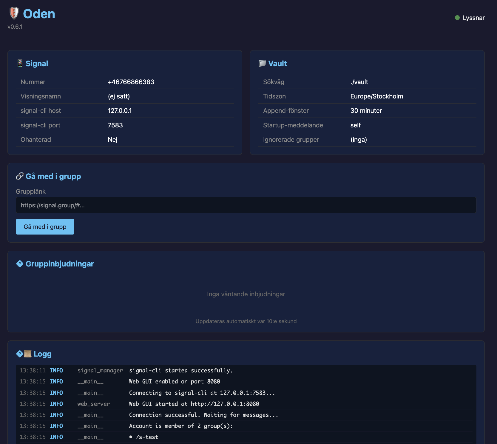
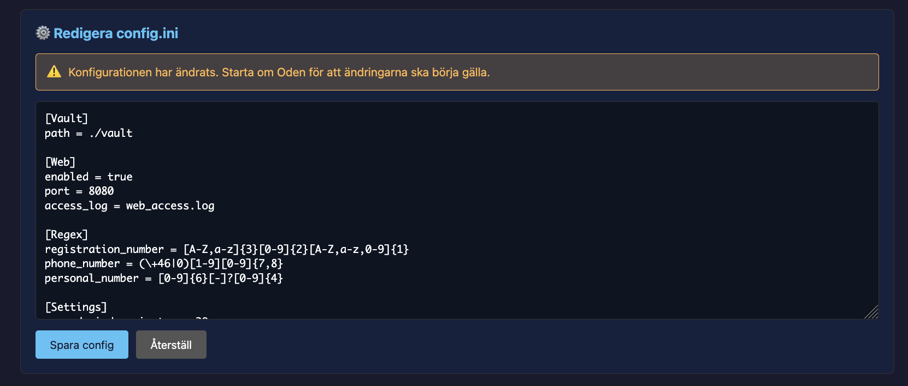
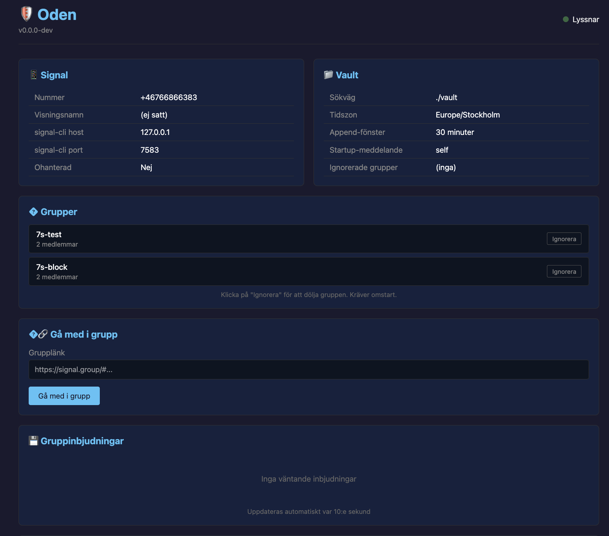

# Oden S7 Watcher


Oden tar emot Signal-meddelanden och sparar dem som Markdown-filer i ditt Obsidian-valv.

## Snabbstart (Release)

Ladda ner senaste releasen och kör skriptet för ditt OS:

| OS | Kommando |
|----|----------|
| macOS | `./run_mac.sh` |
| Linux | `./run_linux.sh` |
| Windows | `.\run_windows.ps1` |

Skriptet hanterar allt: beroenden, Signal-konfiguration och start.

Se [docs/HOW_TO_RUN.md](./docs/HOW_TO_RUN.md) för mer info.

### Signal-konto

**Viktigt:** Använd inte ditt privata Signal-nummer! Skaffa ett dedikerat nummer för Oden (t.ex. ett billigt kontantkort eller VoIP-nummer).

Det finns två sätt att konfigurera Signal:

1. **Länka till befintligt konto** (Rekommenderat) - Koppla Oden som en länkad enhet till din telefon
2. **Registrera nytt nummer** - Använd ett separat telefonnummer som kan ta emot SMS för verifiering

⚠️ **Varning:** Om du registrerar ett nytt nummer utan att först ha det i Signal-appen på en telefon blir Oden den enda enheten för det numret. Detta kan orsaka problem med meddelandesynkronisering och krypteringsnycklar. Det rekommenderas att alltid länka till ett befintligt konto.

---

## För Utvecklare

### Projektstruktur

```text
oden/
├── oden/           # Python-paket med källkod
├── tests/          # Enhetstester
├── scripts/        # run_*.sh/ps1 skript för installation och körning
├── docs/           # Dokumentation
├── responses/      # Svarsmallar för kommandon
└── images/         # Bilder
```

### Installation för utveckling

```bash
# Klona repot
git clone https://github.com/NicklasAndersson/oden.git
cd oden

# Skapa virtuell miljö
python -m venv .venv
source .venv/bin/activate  # På Windows: .venv\Scripts\activate

# Installera paketet i utvecklingsläge
pip install -e .

# Kör tester
pytest

# Kör tester med coverage
pytest --cov=oden

# Kör applikationen
python -m oden
```

### Kodkvalitet

Projektet använder [Ruff](https://docs.astral.sh/ruff/) för linting och formattering:

```bash
# Installera pre-commit hooks (kör en gång)
pip install pre-commit
pre-commit install

# Manuell linting
ruff check .

# Manuell formattering
ruff format .
```

### Funktioner

- **Web GUI** - Webbgränssnitt för att visa config, loggar och hantera gruppinbjudningar
- **Svara på meddelande** - Svaret läggs till i din senaste rapport (inom 30 min)
- **`++` kommando** - Meddelanden som börjar med `++` läggs till i senaste rapporten *(avstängt per default, aktiveras med `plus_plus_enabled = true` i config)*

## Konfiguration

`config.ini` skapas automatiskt av run-skripten, eller redigera manuellt:

```ini
[Vault]
path = /sökväg/till/obsidian-valv

[Signal]
number = +46701234567

[Timezone]
timezone = Europe/Stockholm

[Web]
enabled = true
port = 8080
access_log = web_access.log
```

## Web GUI

Oden har ett inbyggt webbgränssnitt som startar automatiskt på `http://127.0.0.1:8080`.





**Funktioner:**
- Visa aktuell konfiguration
- Live-loggar (uppdateras var 3:e sekund)
- Gå med i grupper via inbjudningslänk
- Visa och hantera väntande gruppinbjudningar
- **Visa alla grupper** kontot är med i
- **Ignorera grupper** direkt från GUI (klicka "Ignorera")
- **Redigera config.ini** direkt i webbläsaren

**Obs:** Ändringar i config kräver omstart för att börja gälla.

**Säkerhet:** Lyssnar endast på localhost - ingen autentisering krävs.

## Dokumentation

- [HOW_TO_RUN.md](./docs/HOW_TO_RUN.md) - Körinstruktioner
- [Flow.md](./docs/Flow.md) - Flödesdiagram
