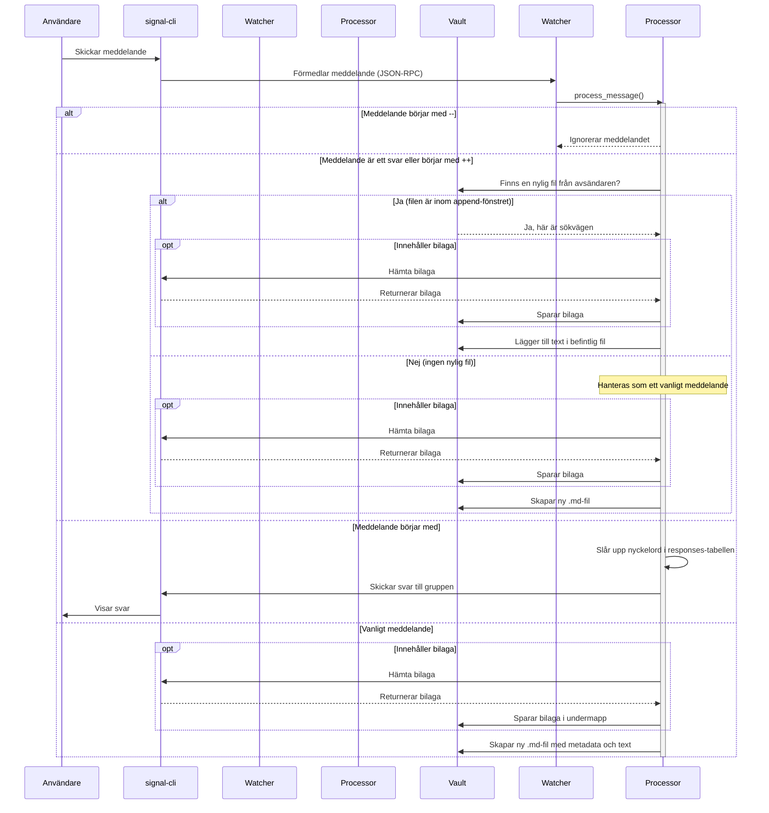

# Funktioner och Kravspecifikation

Oden tar emot Signal-meddelanden via `signal-cli` och sparar dem som Markdown-filer i ett Obsidian-valv. Det här dokumentet är den kompletta kravspecifikationen — varje funktion och konfigurationsnyckel beskrivs i detalj.

**Utbrutna dokument:**

| Dokument | Beskrivning |
|----------|-------------|
| [SETUP_FLOW.md](SETUP_FLOW.md) | Setup-wizardens alla steg (hemkatalog, Signal-länkning, vault-sökväg) |
| [WEB_GUI.md](WEB_GUI.md) | Web-gränssnittets alla sidor, flikar och komplett API-endpointstabell |
| [REPORT_TEMPLATE.md](REPORT_TEMPLATE.md) | Jinja2-mallsystem — placeholders, syntax och anpassning |

---

## Arkitektur

```
┌─────────────┐     ┌──────────────┐     ┌──────────────┐
│ System Tray │────►│ s7_watcher   │◄───►│ signal-cli   │
│ (pystray)   │     │ (entry point)│     │ TCP:7583     │
└─────────────┘     └──────┬───────┘     └──────────────┘
                           │
              ┌────────────┼────────────┐
              │            │            │
     ┌────────▼──┐  ┌──────▼─────┐ ┌────▼────────┐
     │processing │  │ web_server │ │ config.py   │
     │(meddelande│  │ (GUI/API)  │ │ config_db   │
     │behandling)│  └──────┬─────┘ │ (SQLite)    │
     └────────┬──┘         │       └─────────────┘
              │     ┌──────▼─────────────────────┐
     ┌────────▼──┐  │ web_handlers/              │
     │template_  │  │  setup / config / groups   │
     │loader     │  │  templates / responses     │
     │(Jinja2)   │  └───────────────────────────-┘
     └───────────┘
```

**Komponenter:**

- **`s7_watcher.py`** — Startpunkt. Hanterar signal-cli-processen, TCP-anslutning, Web GUI och tray-ikon.
- **`processing.py`** — Kärnlogik. Parsar meddelanden, hanterar kommandon, append-läge och fil-I/O.
- **`config.py` / `config_db.py`** — Konfiguration via SQLite-databas (`config.db`). Exponerar konstanter som `VAULT_PATH`, `SIGNAL_NUMBER`, `TIMEZONE`.
- **`web_server.py` / `web_handlers/`** — aiohttp-baserat webbgränssnitt med setup-wizard och dashboard.
- **`template_loader.py`** — Jinja2-mallmotor med LRU-cache och sandboxed rendering.
- **`tray.py`** — System tray-ikon via pystray (valfritt beroende).

---

## Meddelandeflöde

### Sekvensdiagram



### Bearbetningsordning

När ett meddelande tas emot via JSON-RPC bearbetas det i följande ordning:

1. **Sync-filtrering** — Utgående meddelanden som ekas tillbaka av signal-cli ignoreras.
2. **Whitelist-kontroll** — Om `whitelisted_groups` är satt, tillåts *enbart* de grupperna (har prioritet över `ignored_groups`).
3. **Ignore-kontroll** — Om gruppen finns i `ignored_groups`, avbryts bearbetningen.
4. **Separator `--`** — Om meddelandet börjar med `--` ignoreras det tyst. Inget sparas.
5. **Append-logik** — Se avsnitt nedan.
6. **Kommando `#`** — Se avsnitt [Kommandon & autosvar](#kommandon--autosvar).
7. **Nytt meddelande** — Skapar en ny Markdown-fil i valvet.

### Nytt meddelande

När ett meddelande inte matchar något specialfall skapas en ny `.md`-fil:

1. **Metadata extraheras** — avsändare, grupp, tidsstämpel, bilagor.
2. **Regex-länkning** — textinnehållet analyseras mot konfigurerade mönster och matchningar omvandlas till Obsidian-länkar `[[…]]`.
3. **Platsextraktion** — Google Maps-, Apple Maps- och OSM-URL:er konverteras till `geo:`-koordinater.
4. **Bilagor sparas** — i en unik undermapp under valvet.
5. **Citat formateras** — om meddelandet är ett svar, inkluderas det citerade meddelandet som blockquote.
6. **Jinja2-mall renderas** — `report.md.j2`-mallen renderas med alla variabler.
7. **Fil skrivs** — till `vault/{gruppnamn}/DDHHMM-telefon-namn.md` (beroende på `filename_format`).

### Append-läge (`++`)

Append-läget gör det möjligt att lägga till innehåll i en befintlig rapport istället för att skapa en ny fil.

| Egenskap | Beskrivning |
|----------|-------------|
| **Aktivering** | `plus_plus_enabled` måste vara `True` (standard: `False`) |
| **Prefix** | Meddelandet måste börja med `++` |
| **Tidsfönster** | Avsändarens senaste fil måste vara skapad inom `append_window_minutes` (standard: 30 minuter) |
| **Fillokalisering** | Söker efter `fileid` i frontmatter, med filnamns-fallback för bakåtkompatibilitet |
| **Mall** | Använder `append.md.j2` istället för `report.md.j2` |
| **Fallback** | Om ingen nylig fil hittas, behandlas meddelandet som nytt (utan `++`-prefixet) |

### Reply-append

Att svara på ett meddelande i Signal (reply/quote) triggar också append-logik:

| Egenskap | Beskrivning |
|----------|-------------|
| **Aktivering** | Alltid aktivt (ingen konfigurationsknapp) |
| **Tidsfönster** | Samma som `append_window_minutes` (standard: 30 minuter) |
| **Fillokalisering** | Söker efter den *citerade författarens* senaste fil (inte svararen) |
| **Fallback** | Om ingen nylig fil hittas, behandlas det som ett nytt meddelande med citat-block |

### Ignorera meddelande (`--`)

Meddelanden som börjar med `--` ignoreras helt — de sparas inte och ingen respons skickas. Användbart för informella kommentarer i en grupp som inte ska arkiveras.

---

## Kommandon & autosvar

### Hur det fungerar

1. Användaren skickar `#nyckelord` i en Signal-grupp.
2. Oden tar bort `#`, konverterar till gemener, och söker i `responses`-tabellen i SQLite-databasen.
3. Om nyckelordet matchar, skickas svarstexten tillbaka till gruppen via `signal-cli`.
4. Inget meddelande sparas i valvet — kommandon genererar inte rapporter.

### Standardkommandon

| Kommando | Nyckelord | Svar |
|----------|-----------|------|
| `#help` | `help`, `hjälp` | Hjälptext med de 8 S:en (Stund, Ställe, Styrka, etc.) och användningsinstruktioner |
| `#ok` | `ok` | "Mottaget." |

### Datamodell

Varje kommando/autosvar har:

| Fält | Typ | Beskrivning |
|------|-----|-------------|
| `id` | integer | Unikt id (auto-increment) |
| `keywords` | JSON-lista | Lista med nyckelord som triggar svaret, t.ex. `["help", "hjälp"]` |
| `response_text` | string | Svarstexten som skickas till gruppen |

### Egna kommandon

Utöver standardkommandona kan egna kommandon skapas, redigeras och tas bort via Web GUI:ns autosvar-editor (CRUD). Varje kommando kan ha flera nyckelord som alla triggar samma svar.

→ Se [WEB_GUI.md](WEB_GUI.md) för detaljer om autosvar-editorn.

---

## Regex-länkning

Oden kan automatiskt omvandla textmönster i meddelanden till Obsidian-länkar (`[[…]]`). Matchande text konverteras till `[[matchad text]]` vilket skapar klickbara länkar i Obsidian.

### Standardmönster

| Namn | Regex | Beskrivning | Exempel |
|------|-------|-------------|---------|
| `registration_number` | `[A-Z,a-z]{3}[0-9]{2}[A-Z,a-z,0-9]{1}` | Svenska registreringsnummer | `ABC123` → `[[ABC123]]` |
| `phone_number` | `(\+46\|0)[1-9][0-9]{7,8}` | Svenska telefonnummer | `+46701234567` → `[[+46701234567]]` |
| `personal_number` | `[0-9]{6}[-]?[0-9]{4}` | Svenska personnummer | `900101-1234` → `[[900101-1234]]` |

### Konfiguration

- Mönstren konfigureras via `regex_patterns` (JSON-objekt i config_db).
- Varje mönster har ett namn (nyckel) och ett regex-uttryck (värde).
- Mönster kan läggas till, redigeras och tas bort via Web GUI:ns regex-editor.
- Regex-editorn har inbyggd testfunktion — skriv in testtext och se vilka mönster som matchar.

### Dubbellänkning undviks

Text som redan befinner sig inuti en `[[…]]`-länk matchas inte igen. Detta förhindrar att exempelvis ett telefonnummer som redan är en Obsidian-länk länkas dubbelt.

---

## Grupphantering

### Ignorera grupper

| Egenskap | Beskrivning |
|----------|-------------|
| **Konfigurationsnyckel** | `ignored_groups` |
| **Typ** | JSON-lista med gruppnamn |
| **Standard** | `[]` (ingen grupp ignoreras) |
| **Effekt** | Meddelanden från ignorerade grupper sparas inte |
| **GUI** | Knappen "Ignorera" på grupp-sidan i Web GUI |

### Whitelist-grupper

| Egenskap | Beskrivning |
|----------|-------------|
| **Konfigurationsnyckel** | `whitelisted_groups` |
| **Typ** | JSON-lista med gruppnamn |
| **Standard** | `[]` (alla grupper tillåts) |
| **Effekt** | Om satt, sparas *enbart* meddelanden från dessa grupper |
| **Prioritet** | **Har alltid prioritet** över `ignored_groups` |
| **GUI** | Knappen "Whitelist" på grupp-sidan i Web GUI |

### Prioritetsordning

```
Om whitelisted_groups är satt och inte tom:
  → Enbart whitelisted grupper behandlas (ignored_groups ignoreras helt)
Annars:
  → Alla grupper behandlas, utom de i ignored_groups
```

### Gruppåtgärder via GUI

| Åtgärd | Beskrivning |
|--------|-------------|
| **Visa grupper** | Listar alla grupper kontot är medlem i |
| **Gå med via inbjudningslänk** | Klistra in en `https://signal.group/…`-länk för att gå med i en grupp |
| **Acceptera inbjudan** | Acceptera en väntande gruppinbjudan |
| **Avböj inbjudan** | Avböj en väntande gruppinbjudan (lämnar gruppen) |

---

## Filnamnsformat

Filnamnet för sparade rapporter konfigureras via `filename_format`.

### Tillgängliga format

| Format | Mönster | Exempel |
|--------|---------|---------|
| `classic` (standard) | `DDHHMM-telefon-namn.md` | `261427-46762320406-Nicklas.md` |
| `timestamp_only` | `DDHHMM.md` | `261427.md` |
| `timestamp_name` | `DDHHMM-namn.md` | `261427-Nicklas.md` |

### Filid och deduplicering

| Egenskap | Beskrivning |
|----------|-------------|
| **Filid** | Varje rapport har ett `fileid`-fält i frontmatter (YAML). Format: `DDHHMM-telefon-namn` — konsekvent oavsett filnamnsformat. |
| **Deduplicering** | Om en fil med samma namn redan finns, läggs `-1`, `-2`, etc. till som suffix. |
| **Append-sökning** | Append-läget söker efter `fileid` i frontmatter för att hitta rätt fil, med filnamns-fallback för bakåtkompatibilitet. |

### Mappsökväg

Filer sparas i: `vault/{gruppnamn}/filnamn.md`

Gruppnamnet saniteras för att vara ett giltigt mappnamn (ogiltiga tecken tas bort).

---

## Bilagor

Signal-meddelanden kan innehålla bilagor (bilder, filer, etc.). Oden hanterar dem automatiskt.

| Egenskap | Beskrivning |
|----------|-------------|
| **Nedladdning** | Bilagor hämtas via `getAttachment` JSON-RPC-anrop till signal-cli |
| **Lagring** | Sparas i unik undermapp: `vault/{grupp}/attachments/{unikt-id}/` |
| **Filnamn** | Saniterade originalnamn, med indexprefix (`1_`, `2_`, etc.) |
| **Embed-syntax** | Returneras som Obsidian-embeds: `![[attachments/{id}/1_bild.jpg]]` |
| **Sökvägsskydd** | Path traversal-skydd via `sanitize_filename()` |

---

## Platsextraktion

Oden extraherar automatiskt koordinater från plats-URL:er i meddelanden och konverterar dem till `geo:`-länkar som fungerar med Obsidian Map View-pluginet.

### Stödda URL-format

| Källa | URL-mönster | Exempel |
|-------|------------|---------|
| **Google Maps** | `maps.google.com/maps?q=LAT%2CLON` | `maps.google.com/maps?q=59.33%2C18.07` |
| **Google Maps** | `google.com/maps?q=LAT,LON` | `google.com/maps?q=59.33,18.07` |
| **Apple Maps** | `maps.apple.com/?q=LAT,LON` | `maps.apple.com/?q=59.33,18.07` |
| **Apple Maps** | `maps.apple.com/?ll=LAT,LON` | `maps.apple.com/?ll=59.33,18.07` |
| **OpenStreetMap** | `openstreetmap.org/?mlat=LAT&mlon=LON` | `openstreetmap.org/?mlat=59.33&mlon=18.07` |
| **OpenStreetMap** | `openstreetmap.org/#map=ZOOM/LAT/LON` | `openstreetmap.org/#map=15/59.33/18.07` |

### Utdata

Extraherade koordinater läggs till i rapportmallens kontext som `lat` och `lon`. I standardmallen renderas de som:

```markdown
[Position](geo:59.33,18.07)
```

Koordinaterna lagras även i frontmatter som `locations`-fält för Obsidian Map View-kompatibilitet.

---

## System tray

Oden kan visa en ikon i systemfältet (macOS, Linux, Windows) för snabbåtkomst.

### Beroenden

| Paket | Roll | Installation |
|-------|------|-------------|
| `pystray` | System tray-funktionalitet | `pip install oden[tray]` |
| `Pillow` | Ikonhantering | Installeras som beroende till pystray |

Om paketen inte är installerade körs Oden i **terminalläge** utan tray-ikon. I Docker är tray alltid inaktiverat (ingen display).

### Menyalternativ

| Alternativ | Beskrivning |
|-----------|-------------|
| **Oden vX.X.X** | Versionsinformation (inaktiverat, enbart visning) |
| ─── | Separator |
| **▶ Starta** / **⏹ Stoppa** | Startar eller stoppar signal-cli-lyssnaren. Texten ändras dynamiskt. |
| **🌐 Öppna Web GUI** | Öppnar `http://127.0.0.1:{port}` i standardwebbläsaren |
| ─── | Separator |
| **Avsluta** | Stänger ner Oden helt (stoppar signal-cli, web-server och alla bakgrundsuppgifter) |

### macOS-krav

På macOS kräver pystray att NSApplication-eventloopen körs på huvudtråden. Oden hanterar detta automatiskt genom att starta tray-ikonen före asyncio-loopen.

### Ikonladdning

Oden försöker ladda ikonen i följande ordning:

1. Bundlad ikon (PyInstaller-paket)
2. Källkodsträdet (`images/logo_small.jpg`)
3. Fallback: genererad blå cirkel

---

## Konfiguration

All konfiguration lagras i en SQLite-databas (`config.db`) i Oden-hemkatalogen. Modulen `config.py` läser in värden vid start och exponerar dem som Python-konstanter.

### Konfigurationsnycklar

#### Grundläggande

| Nyckel | Typ | Standard | Beskrivning |
|--------|-----|----------|-------------|
| `vault_path` | string | `~/vault` | Sökväg till Obsidian-valvet |
| `signal_number` | string | `+46XXXXXXXXX` | Signal-telefonnummer |
| `display_name` | string | *(tomt)* | Signal-visningsnamn |
| `timezone` | string | `Europe/Stockholm` | Tidszon för tidsstämplar |
| `filename_format` | string | `classic` | Filnamnsformat: `classic`, `timestamp_only`, `timestamp_name` |
| `log_level` | string | `INFO` | Loggnivå: `DEBUG`, `INFO`, `WARNING`, `ERROR` |

#### Signal-cli

| Nyckel | Typ | Standard | Beskrivning |
|--------|-----|----------|-------------|
| `signal_cli_path` | string | *(auto)* | Sökväg till signal-cli-körbar fil |
| `signal_cli_host` | string | `127.0.0.1` | signal-cli TCP-värd |
| `signal_cli_port` | integer | `7583` | signal-cli TCP-port |
| `signal_cli_log_file` | string | *(ingen)* | Fil för signal-cli stdout/stderr |
| `unmanaged_signal_cli` | boolean | `False` | Om `True`, startar/stoppar Oden inte signal-cli (extern hantering) |

#### Meddelandehantering

| Nyckel | Typ | Standard | Beskrivning |
|--------|-----|----------|-------------|
| `plus_plus_enabled` | boolean | `False` | Aktivera `++` append-prefix |
| `append_window_minutes` | integer | `30` | Tidsfönster för append-läge (minuter) |
| `ignored_groups` | JSON-lista | `[]` | Gruppnamn att ignorera |
| `whitelisted_groups` | JSON-lista | `[]` | Om satt, enbart dessa grupper behandlas |
| `regex_patterns` | JSON-objekt | *(3 standardmönster)* | Namngivna regex-mönster för autolänkning |
| `startup_message` | string | `first` | Startmeddelande: `first`, `all`, `off` |

#### Webb & loggning

| Nyckel | Typ | Standard | Beskrivning |
|--------|-----|----------|-------------|
| `web_enabled` | boolean | `True` | Aktivera webbgränssnitt |
| `web_port` | integer | `8080` | Webbgränssnittets port |
| `web_access_log` | string | *(ingen)* | Fil för HTTP access-loggar |
| `log_file` | string | *(plattformsberoende)* | Sökväg till loggfil |

#### Mallar (lagras i config_db)

| Nyckel | Typ | Standard | Beskrivning |
|--------|-----|----------|-------------|
| `report_template` | string | *(ej satt)* | Anpassad rapportmall (Jinja2) |
| `append_template` | string | *(ej satt)* | Anpassad append-mall (Jinja2) |

### Miljövariabler

Dessa miljövariabler överstyr konfigurationsdatabasen:

| Variabel | Beskrivning | Användning |
|----------|-------------|------------|
| `ODEN_HOME` | Oden-hemkatalog (config.db, signal-data) | Docker: `ODEN_HOME=/data` |
| `WEB_HOST` | Bind-adress för webbgränssnitt | Docker: `WEB_HOST=0.0.0.0` |
| `SIGNAL_CLI_PATH` | Sökväg till signal-cli | Överstyr `signal_cli_path` i config |

### INI-export/import

Konfigurationen kan exporteras till och importeras från INI-format (`.ini`-filer) för bakåtkompatibilitet och enkel delning. Tillgängligt via Web GUI:ns konfigurationssida.

---

## Loggning

Oden loggar till tre destinationer samtidigt.

### Loggdestinationer

| Destination | Beskrivning |
|-------------|-------------|
| **Konsol** | Alltid aktiv. Skriver till stdout. |
| **Loggfil** | Roterande fil med max 5 MB, 3 backupfiler. |
| **Minnesbuffert** | Cirkulärbuffert med 500 poster för live-loggar i Web GUI. |

### Plattformsspecifika sökvägar

| Plattform | Loggfilsökväg |
|-----------|---------------|
| **macOS** | `~/Library/Logs/Oden/oden.log` |
| **Linux** | `~/.local/state/oden/oden.log` |
| **Windows** | `%LOCALAPPDATA%\Oden\Logs\oden.log` |

### Loggnivå

Loggnivån (`log_level`) sparas persistent i en separat `log_level`-fil. Vid första start används `DEBUG` (verbose) tills setup är klar, därefter sparas den konfigurerade nivån.

Tillgängliga nivåer: `DEBUG`, `INFO`, `WARNING`, `ERROR`.

---

## Docker

Oden distribueras som en multi-arch Docker-image (`linux/amd64`, `linux/arm64`) via GitHub Container Registry.

### Konfiguration

| Miljövariabel | Värde | Beskrivning |
|---------------|-------|-------------|
| `ODEN_HOME` | `/data` | Hemkatalog — volymmountas för persistens |
| `WEB_HOST` | `0.0.0.0` | Bind till alla interface (åtkomst utifrån) |

### Exempel med Docker Compose

```yaml
services:
  oden:
    image: ghcr.io/nicklasandersson/oden:latest
    ports:
      - "8080:8080"
    volumes:
      - oden-data:/data
      - ./vault:/vault
    environment:
      - ODEN_HOME=/data
      - WEB_HOST=0.0.0.0
    restart: unless-stopped
volumes:
  oden-data:
```

### Skillnader mot macOS

| Funktion | macOS | Docker |
|----------|-------|--------|
| System tray | ✅ Aktiv (pystray) | ❌ Inaktiverad (ingen display) |
| Sökvägsbegränsning | Begränsad till hemkatalogen | Relaxerad (valfri sökväg) |
| Web-binding | `127.0.0.1` (localhost) | `0.0.0.0` (alla interface) |
| signal-cli | Bundlad eller lokal | Installerad i image |

---

## Setup-flöde

Vid första start (eller om konfigurationen saknas) aktiveras en setup-wizard som guidar genom all nödvändig konfiguration: val av hemkatalog, Signal-kontolänkning via QR-kod eller registrering, vault-sökväg och Obsidian-mallinstallation.

→ Se [SETUP_FLOW.md](SETUP_FLOW.md) för detaljerad beskrivning av varje steg.

---

## Web-gränssnitt

Oden har ett inbyggt webbgränssnitt (aiohttp) som startar automatiskt på `http://127.0.0.1:8080`. Det har två lägen: **setup-mode** (första start) och **dashboard-mode** (normal drift). Dashboarden ger tillgång till konfiguration, live-loggar, grupphantering, template-editor, autosvar-editor och regex-editor.

→ Se [WEB_GUI.md](WEB_GUI.md) för fullständig beskrivning av alla sidor, flikar och API-endpoints.

---

## Mallsystem

Oden använder Jinja2-mallar för att formatera Signal-rapporter som Markdown-filer. Två mallar finns: `report.md.j2` (nya rapporter) och `append.md.j2` (tillägg). Mallarna kan anpassas via Web GUI:ns template-editor med live-förhandsvisning, eller genom att redigera mallfiler direkt.

→ Se [REPORT_TEMPLATE.md](REPORT_TEMPLATE.md) för komplett dokumentation av placeholders, Jinja2-syntax och anpassning.
