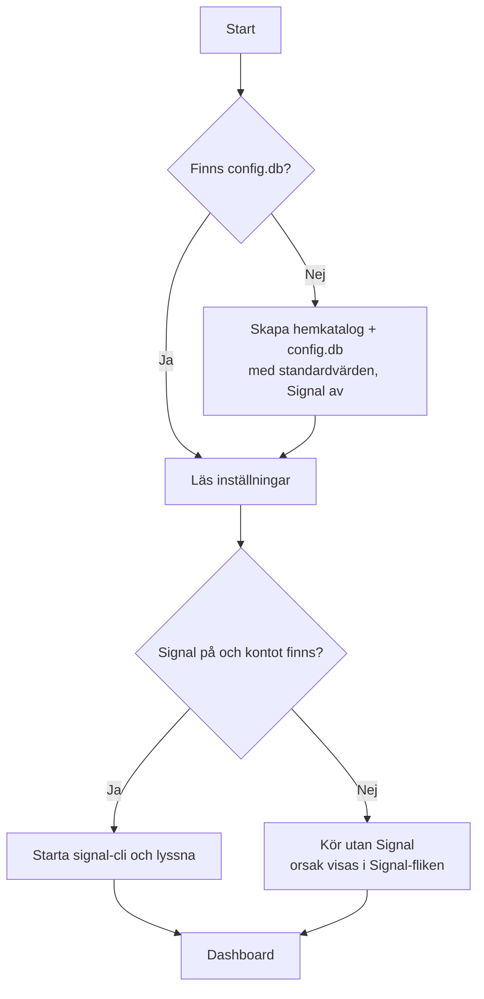

# Första start och koppling av Signal

Oden har ingen setup-guide. Vid första start skapas standardinställningar och
webbgränssnittet öppnas direkt i dashboard-läge; valv, Signal och TAK ställs in
i sina egna flikar, när man vill.

---

## Första start

| Vad | Hur |
|-----|-----|
| **Hemkatalog** | `ODEN_HOME` om den är satt (Docker: `/data`), annars `~/.oden`. Innehåller `config.db`, `signal-data/` och loggar. En befintlig `config.db` där används som den är. Kan bytas under Avancerat (se nedan). |
| **Pekarfil** | Sökvägen sparas i en pekarfil så att Oden hittar tillbaka; saknas den men `~/.oden/config.db` finns återskapas den automatiskt. |
| **Standardvärden** | Samma som `DEFAULT_CONFIG` i `config_db.py`, men med `signal_enabled = false` — det finns inget konto att lyssna på än. |
| **Valv** | `ODEN_VAULT` om den är satt (Docker: `/vault`), annars `~/oden-vault`. Byts under fliken **Obsidian**. |
| **Webbläsare** | Öppnas mot dashboarden vid första start. |
| **Korrupt databas** | Ersätts aldrig tyst: Oden avslutar med ett felmeddelande som säger vilken fil som ska flyttas undan. |

## Byta hemkatalog (Avancerat)

Under **Avancerat → Oden-hemkatalog** visas katalogen Oden kör från och den som
gäller efter omstart. Ange en ny:

| Katalogen | Då |
|-----------|----|
| **finns inte eller är tom** | Allt kopieras dit: `config.db` (via SQLite:s backup, konsistent medan Oden kör), `signal-data/`, TAK-certifikat, loggar. Stoppa gärna Signal först. |
| **har en `config.db`** | Den används som den är — t.ex. för att gå tillbaka till en tidigare installation. |
| **är inte tom men saknar `config.db`** | Nekas. |

Den gamla katalogen ligger kvar som reserv. Bytet sparas i pekarfilen och gäller
efter omstart. Är `ODEN_HOME` satt (Docker) styr den, och fältet är låst.

## När Signal inte kan startas

Är Signal påslaget men inget konto kopplat (eller det sparade kontot finns inte
längre i signal-cli) startar Oden ändå, utan Signal. Orsaken visas överst i
**Signal**-fliken och i loggen. Inställningen ändras inte — kopplas kontot in
igen fungerar det vid nästa start.

## Koppla Signal (Signal → Konton)

När Oden körs utan Signal visar **Signal → Konton** rutan *Koppla Signal*:

### Konton som redan finns i signal-cli

Oden läser `signal-cli/data/` direkt (utan JVM). Varje konto har en knapp
**Använd**, som sparar det som Odens konto och slår på Signal.

### Länka befintligt konto (rekommenderat)

| Steg | Beskrivning |
|------|-------------|
| 1. **QR-kod** | *Visa QR-kod* kör `signal-cli link` fristående (ingen daemon behövs) och visar koden. |
| 2. **Skanna** | Signal-appen: *Inställningar → Länkade enheter → Lägg till enhet*. |
| 3. **Klart** | Oden väntar upp till 60 sekunder; när länkningen lyckats används numret automatiskt. |

### Registrera nytt nummer

Telefonnummer (internationellt format), SMS eller röstsamtal, CAPTCHA om
Signal kräver det (länk till signalcaptchas.org visas), sedan verifieringskoden.

⚠️ Oden blir då den enda enheten på numret. Länka hellre ett konto som redan
finns i Signal på en telefon.

### Omstart

Valet läses vid uppstart: efter att ett konto kopplats (eller Signal stängts av
under **Signal → Inställningar → Signal på/av**) startar man om Oden.

### Fler konton

Med Signal igång länkas fler konton under **Signal → Konton → Lägg till konto**
(via signal-cli-daemonen). Oden behandlar meddelanden för ett aktivt konto åt gången.

## Obsidian

Fliken **Obsidian** har valvets sökväg, katalogstrukturen (grupp-uppdelning)
och knappen **Installera Obsidian-inställningar**, som kopierar Odens
`.obsidian`-mapp (bl.a. Map View) till valvet. En befintlig `.obsidian`-mapp
skrivs aldrig över.

## API

| Metod | Sökväg | Beskrivning |
|-------|--------|-------------|
| GET | `/api/signal/connect/status` | Signal på/av, varför av, pågående länkning; `?accounts=1` listar konton i signal-cli |
| POST | `/api/signal/connect/link` | Starta QR-länkning (bara när Signal inte körs) |
| POST | `/api/signal/connect/link-cancel` | Avbryt länkning |
| POST | `/api/signal/connect/register` | Registrera nummer (`phone_number`, `use_voice`, `captcha_token`) |
| POST | `/api/signal/connect/verify` | Verifiera registreringskod (`code`) |
| POST | `/api/signal/connect/use` | Använd ett signal-cli-konto (`signal_number`) och slå på Signal |
| POST | `/api/signal/connect/disable` | Stäng av Signal |
| GET | `/api/oden-home` | Nuvarande hemkatalog, den som gäller efter omstart, om `ODEN_HOME` styr |
| POST | `/api/oden-home` | Byt hemkatalog (`path`) — kopiera eller byt, gäller efter omstart |
| GET | `/api/obsidian/status` | Valvets sökväg och om Obsidian-inställningarna finns |
| POST | `/api/obsidian/install-template` | Installera Odens `.obsidian` i valvet |
