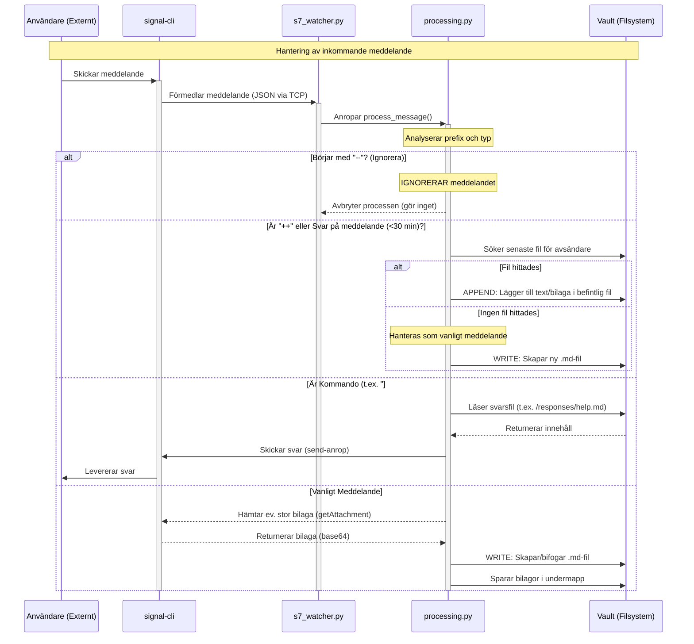

# Flödesskiss för Oden

Det här dokumentet beskriver flödet för hur ett inkommande Signal-meddelande hanteras och arkiveras av applikationen.

## Detaljerad beskrivning

### Komponenter

* **Externt (Utanför):** En person som skickar ett meddelande via Signal-appen till det nummer som applikationen bevakar.
* **`signal-cli`:** Körs som en bakgrundsprocess (daemon) och hanterar den direkta kommunikationen med Signals servrar. Den tar emot meddelanden och exponerar ett lokalt JSON-RPC API över en TCP-socket. Den kan också ta emot anrop för att skicka meddelanden eller hämta data.
* **`s7_watcher.py` (Watcher):** En Python-process som kontinuerligt är ansluten till `signal-cli`-daemonen. Dess enda syfte är att lyssna efter inkommande meddelanden, och när ett tas emot, skicka det vidare till `processing.py` för behandling.
* **`processing.py` (Processor):** Applikationens kärna. Detta skript innehåller all logik för att tolka, formatera och agera på ett meddelande.
* **Vault (Filsystem):** En mappstruktur (`/vault`) på datorn där meddelanden och deras bilagor sparas som Markdown-filer i ett [Obsidian](https://obsidian.md)-kompatibelt format.

### Flöde 1: Vanligt meddelande

1. En användare skickar ett meddelande (som kan innehålla text, en bild, en fil eller en plats) till en grupp där boten är medlem.
2. `signal-cli` tar emot meddelandet och skickar det som ett JSON-objekt till `s7_watcher.py`.
3. `s7_watcher.py` tar emot JSON-objektet och anropar `process_message`-funktionen i `processing.py`.
4. `processing.py` parsar meddelandet:
   * Extraherar text, avsändare, grupp, tidsstämpel och eventuella bilagor.
   * Om en bilaga är för stor för att ha skickats med direkt i JSON, görs ett anrop tillbaka till `signal-cli` för att hämta den.
   * Textinnehållet analyseras för specifika mönster (definierade i `config.ini`) som automatiskt omvandlas till Obsidian-länkar (`[[länk]]`).
   * En sökväg till en Markdown-fil bestäms baserat på gruppnamn och datum.
5. Processorn sparar bilagor i en unik undermapp i valtet.
6. Processorn skriver eller lägger till det formaterade innehållet (metadata, text, länkar till bilagor) i rätt `.md`-fil i valtet.

### Flöde 2: Kommando

1. En användare skickar ett meddelande som börjar med `#`, t.ex. `#help` eller `#ok`.
2. `signal-cli` och `s7_watcher.py` hanterar meddelandet precis som i flöde 1 och skickar det till `processing.py`.
3. `processing.py` upptäcker att meddelandet är ett kommando.
4. Processorn letar efter en fil med motsvarande namn i mappen `/responses` (t.ex. `/responses/help.md`).
5. Om filen finns, läses dess innehåll in.
6. Processorn gör ett `send`-anrop till `signal-cli`:s API med innehållet från svarsfilen.
7. `signal-cli` skickar innehållet som ett vanligt Signal-meddelande tillbaka till gruppen som en respons.

### Flöde 3: Särskilda Meddelanden

Vissa meddelanden som börjar med specifika prefix hanteras på ett unikt sätt.

*   **Svara på meddelande:**
    1. En användare svarar på ett meddelande i gruppen (oavsett vem som skrev originalet).
    2. Om originalmeddelandet är mindre än 30 minuter gammalt, tolkar `processing.py` detta som en signal att lägga till i en befintlig rapport.
    3. Systemet letar efter den senaste filen som skapats av *svararen* (den som skriver det nya meddelandet) och lägger till det nya innehållet där.

*   **Lägg till i föregående (`++`):**
    1. En användare skickar ett meddelande som börjar med `++`. Detta fungerar som ett alternativ till att svara, och letar också efter den senaste filen från avsändaren inom 30 minuter att lägga till i.
    2. Om ingen nylig fil hittas, behandlas meddelandet som ett vanligt meddelande (Flöde 1), men utan `++`-prefixet.

*   **Ignorera meddelande (`--`):**
    1. En användare skickar ett meddelande som börjar med `--`.
    2. `processing.py` identifierar prefixet och avbryter omedelbart all vidare bearbetning.
    3. Meddelandet ignoreras helt och sparas inte i valvet. Detta är användbart för informella kommentarer eller sidoanteckningar i en grupp som inte ska arkiveras.
