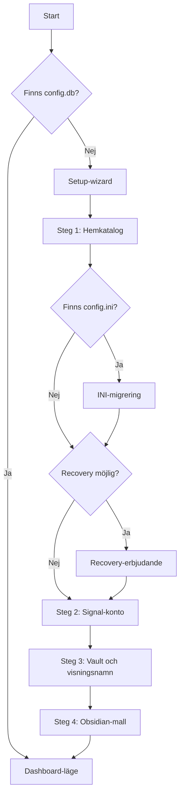

# Setup-flöde

Det här dokumentet beskriver Odens setup-wizard i detalj — alla steg som genomförs vid första start eller när konfigurationen saknas.

Setup-wizarden körs som en del av webbgränssnittet och nås via `http://127.0.0.1:8080/setup`.

---

## Översikt

---

## Steg 1: Välj hemkatalog

Första steget väljer var Odens konfiguration och data ska lagras.

| Egenskap | Beskrivning |
|----------|-------------|
| **Standard** | `~/.oden` |
| **Innehåll** | `config.db` (SQLite), signal-cli-data, loggfiler |
| **Validering** | Måste vara inom hemkatalogen (relaxerat i Docker med `ODEN_HOME`) |
| **Pointer-fil** | Sökvägen sparas i en pointer-fil så att Oden hittar tillbaka vid nästa start |

### Sökvägvalidering

Oden validerar att sökvägen:

- Är en absolut sökväg
- Ligger inom användarens hemkatalog (skydd mot oavsiktlig skrivning utanför)
- Kan skapas om den inte redan finns

I Docker-miljö (när `ODEN_HOME` är satt) relaxeras hemkatalog-begränsningen — valfri sökväg tillåts.

---

## INI-migrering

Om en `config.ini`-fil detekteras (från äldre Oden-versioner) erbjuds automatisk migrering.

| Egenskap | Beskrivning |
|----------|-------------|
| **Detektion** | Söker efter `config.ini` i aktuell katalog och Oden-hemkatalogen |
| **Åtgärd** | Importerar alla inställningar till SQLite-databasen |
| **Valfritt** | Användaren kan välja att hoppa över migreringen |
| **INI-format** | Bakåtkompatibelt format som fortfarande stöds för export/import |

---

## Recovery

Om pointer-filen saknas men en `config.db` redan finns på standardplatsen (`~/.oden/config.db`), erbjuds recovery.

| Egenskap | Beskrivning |
|----------|-------------|
| **Detektion** | Pointer-fil saknas + `config.db` finns på `~/.oden/config.db` |
| **Åtgärd** | Återskapar pointer-filen och använder befintlig config |
| **Valfritt** | Användaren kan välja att skapa ny konfiguration istället |

---

## Steg 2: Länka Signal-konto

Signal-kontot konfigureras på ett av två sätt:

### Alternativ A: Länka till befintligt konto (rekommenderat)

Kopplar Oden som en länkad enhet till ett befintligt Signal-konto.

| Steg | Beskrivning |
|------|-------------|
| 1. **QR-kod genereras** | Server-side via `segno`-biblioteket (SVG-format). Anropet `addDevice` till signal-cli genererar en länknings-URI. |
| 2. **Användaren skannar** | QR-koden visas i webbläsaren. Användaren skannar med Signal-appen: *Inställningar → Länkade enheter → Lägg till enhet*. |
| 3. **Pollning** | Oden pollar signal-cli i upp till 60 sekunder för att vänta på att länkningen slutförs. |
| 4. **Bekräftelse** | När länkningen lyckas visas det registrerade numret och setup fortsätter. |

**Timeout:** Om 60 sekunder passerar utan slutförd länkning avbryts processen och användaren kan försöka igen.

### Alternativ B: Registrera nytt nummer

Registrerar ett nytt Signal-nummer direkt.

| Steg | Beskrivning |
|------|-------------|
| 1. **Ange nummer** | Användaren anger telefonnumret i internationellt format (t.ex. `+46701234567`). |
| 2. **Verifieringsmetod** | Välj SMS eller röstsamtal. |
| 3. **CAPTCHA** | Om Signal kräver CAPTCHA, visas instruktioner för att hämta token. |
| 4. **Verifieringskod** | Ange den mottagna koden (6 siffror). |
| 5. **Bekräftelse** | Numret registreras och setup fortsätter. |

⚠️ **Varning:** Om du registrerar ett nytt nummer utan att först ha det i Signal-appen på en telefon blir Oden den enda enheten. Det rekommenderas att alltid länka till ett befintligt konto.

### Kontodetektion

Oden kan automatiskt detektera befintliga Signal-konton genom att läsa `signal-cli/data/`-katalogen direkt — utan att starta JVM:en. Om konton hittas erbjuds de som alternativ.

---

## Steg 3: Vault-sökväg och visningsnamn

| Inställning | Beskrivning |
|-------------|-------------|
| **Vault-sökväg** | Sökväg till Obsidian-valvet där rapporter ska sparas. Valideras på samma sätt som hemkatalogen. Standard: `~/vault`. |
| **Visningsnamn** | Signal-visningsnamn som används av Oden. Frivilligt fält. |

---

## Steg 4: Obsidian-mallinstallation

Det sista steget erbjuder att installera Obsidian-inställningar i valvet.

| Egenskap | Beskrivning |
|----------|-------------|
| **Innehåll** | `.obsidian/`-katalog med grundinställningar och Map View-plugin |
| **Map View** | Plugin som visar `geo:`-positioner från rapporter på en karta |
| **Valfritt** | Kan hoppas över om valvet redan har Obsidian-inställningar |
| **Överskrivning** | Befintliga `.obsidian/`-inställningar skrivs inte över |

---

## Efter setup

När alla steg är genomförda:

1. Konfigurationen sparas till `config.db`
2. Webbgränssnittet växlar automatiskt till **dashboard-läge**
3. signal-cli startas och Oden börjar lyssna efter meddelanden
4. Tray-ikonen (om tillgänglig) uppdateras till aktivt läge
